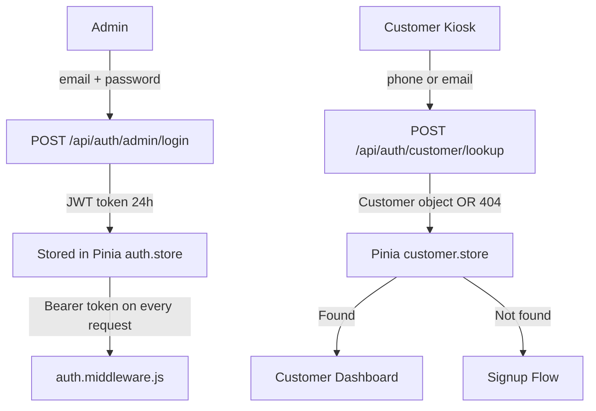

# Architecture Plan: Wine Loyalty & Rewards Desktop App

A senior architect review of the current state and a full production-ready design for the native desktop loyalty application targeting wine businesses, built on Electron + Vue 3 + Node.js + PostgreSQL.

---

## User Review Required

> [!IMPORTANT]
> The new requirements differ significantly from the current schema and backend. A **breaking migration** is required. The following changes affect existing tables:
> - `Customer`: `firstName + lastName` → single `name` field; `phone` and `email` get unique constraints
> - `Reward`: field renames (`name→rewardName`, `pointsCost→pointsRequired`, `requiresStock` removed)
> - `Inventory`: decoupled from `Reward` — now an independent wine catalog table
> - New tables: `Promotion`, `AppSettings`
>
> Since you are in early development with seed/test data only, this migration is safe to run.

> [!WARNING]
> **Customer Authentication is Lookup-Based (No Password)**
> The customer "login" is a phone/email lookup only — no password required. This is intentional for a kiosk-style UX. Only Admins use JWT-based authentication.

---

## Architecture Overview

```
┌─────────────────────────────────────────────────┐
│        Electron Shell (Native Window)           │
│  ┌──────────────────────────────────────────┐   │
│  │     Vue 3 + Pinia + Tailwind CSS         │   │
│  │  Admin App         Customer Kiosk App    │   │
│  └──────────────┬──────────────┬────────────┘   │
│                 │ axios/HTTP   │                 │
└─────────────────┼──────────────┼─────────────────┘
                  ▼              ▼
┌─────────────────────────────────────────────────┐
│         Node.js + Express REST API              │
│  Routes → Controllers → Services → Repos        │
└─────────────────────────┬───────────────────────┘
                          ▼
┌─────────────────────────────────────────────────┐
│       PostgreSQL (Remote: 10.0.0.19)            │
│   Managed via Prisma ORM                        │
└─────────────────────────────────────────────────┘
```

**Key design decisions:**
- Frontend talks to backend via HTTP only (no direct DB access from Electron)
- Backend is fully reusable for a future website — no Electron coupling
- Admin JWT auth; Customer is kiosk-lookup (phone or email, no password)
- Layout position (left/top/bottom) is a runtime setting from `AppSettings`, not a build-time choice

---

## Proposed Changes

### Database Layer

#### [MODIFY] [schema.prisma](file:///c:/Users/ryoin/OneDrive/Desktop/Project/Project%20using%20AI/Loyalty%20Recording/backend/prisma/schema.prisma)

Complete schema redesign. Run as a new migration named `redesign_schema_v2`.

```prisma
generator client {
  provider = "prisma-client-js"
}

datasource db {
  provider = "postgresql"
  url      = env("DATABASE_URL")
}

model Admin {
  id        String   @id @default(uuid())
  email     String   @unique
  password  String
  firstName String
  lastName  String
  createdAt DateTime @default(now())

  @@map("admins")
}

model Customer {
  id           String        @id @default(uuid())
  name         String
  phone        String?       @unique
  email        String?       @unique
  points       Int           @default(0)
  createdAt    DateTime      @default(now())
  transactions Transaction[]

  @@map("customers")
}

model Reward {
  id                String        @id @default(uuid())
  rewardName        String
  rewardDescription String?
  imageUrl          String?
  pointsRequired    Int
  isActive          Boolean       @default(true)
  createdAt         DateTime      @default(now())
  transactions      Transaction[]

  @@map("rewards")
}

model Inventory {
  id            String   @id @default(uuid())
  name          String
  description   String?
  imageUrl      String?
  price         Decimal? @db.Decimal(10, 2)
  stockQuantity Int      @default(0)
  isPromoted    Boolean  @default(false)
  createdAt     DateTime @default(now())

  @@map("inventory")
}

model Promotion {
  id            String    @id @default(uuid())
  title         String
  imageUrl      String?
  targetSection String?   // dashboard | rewards | global
  startDate     DateTime?
  endDate       DateTime?
  isActive      Boolean   @default(true)
  createdAt     DateTime  @default(now())

  @@map("promotions")
}

model Transaction {
  id          String   @id @default(uuid())
  customerId  String
  rewardId    String?
  type        String   // earn | redeem | manual_adjust
  points      Int
  description String?
  createdAt   DateTime @default(now())
  customer    Customer @relation(fields: [customerId], references: [id])
  reward      Reward?  @relation(fields: [rewardId], references: [id])

  @@map("transactions")
}

model AppSettings {
  id                   String   @id @default(uuid())
  navigationPosition   String   @default("left")  // left | top | bottom
  adsEnabled           Boolean  @default(true)
  defaultWelcomePoints Int      @default(0)
  businessName         String?
  logoUrl              String?
  updatedAt            DateTime @updatedAt

  @@map("app_settings")
}
```

**Scalability note:** To support multi-tenant SaaS later, add `businessId String` to `Customer`, `Reward`, `Inventory`, `Promotion`, `Transaction`, `AppSettings` — the architecture is ready for this without refactoring.

---

### Backend — New & Modified Files

#### [MODIFY] `src/routes/index.js`
Add new route mounts: `/promotions`, `/inventory`, `/settings`.

#### [NEW] `src/routes/promotion.routes.js`
#### [NEW] `src/routes/settings.routes.js`

Route definitions for promotions CRUD and settings read/write.

---

#### [NEW] `src/controllers/promotion.controller.js`
#### [NEW] `src/controllers/settings.controller.js`

---

#### [NEW] `src/services/promotion.service.js`

Business logic:
- Filter promotions by active status AND date range (`startDate <= now <= endDate`)
- Activate/deactivate

#### [NEW] `src/services/settings.service.js`

- `getSettings()` — fetch or create default settings (singleton pattern)
- `updateSettings(data)`

#### [NEW] `src/services/inventory.service.js`

Decoupled from rewards. Manages wine catalog independently.

---

#### [NEW] `src/repositories/promotion.repository.js`
#### [NEW] `src/repositories/settings.repository.js`
#### [MODIFY] `src/repositories/inventory.repository.js`

Rewrite as standalone (currently linked to reward).

---

#### [MODIFY] `src/services/customer.service.js`

- Rename `createCustomer()` to use `name` field (not firstName+lastName)
- Add `lookupByPhoneOrEmail(identifier)` — used by customer kiosk login

#### [MODIFY] `src/controllers/transaction.controller.js`

Add `exportCsv()` method that streams CSV response using `json2csv`.

#### [NEW] `src/validators/` (all files)

Add Joi validation for all routes:
- `customer.validator.js`
- `reward.validator.js`
- `transaction.validator.js`
- `inventory.validator.js`
- `promotion.validator.js`

#### [MODIFY] `backend/.env`
Add `JWT_SECRET`, `PORT`, and later `UPLOAD_DIR` for file storage.

---

#### File Uploads (Images)

Add `multer` to handle image uploads for Inventory, Rewards, Promotions, and Settings (logo).

```
backend/
└── uploads/           ← served as static files via Express
    ├── rewards/
    ├── inventory/
    ├── promotions/
    └── logo/
```

Endpoint pattern: `POST /api/upload` with `multipart/form-data`.

---

### Frontend — Full Scaffold

#### [NEW] `frontend/` — Complete Project

Using `electron-vite` (the modern standard for Electron + Vite + Vue 3).

```
frontend/
├── electron.vite.config.js
├── package.json
├── tailwind.config.js
├── postcss.config.js
│
├── electron/                      ← Main process
│   ├── main.js                    ← BrowserWindow setup, app lifecycle
│   └── preload.js                 ← contextBridge (safe IPC if needed)
│
└── src/
    ├── main.js                    ← Vue app entry point
    ├── App.vue                    ← Root component, router-view
    │
    ├── router/
    │   └── index.js               ← Vue Router (admin + customer routes, guards)
    │
    ├── stores/                    ← Pinia stores
    │   ├── auth.store.js          ← Admin JWT, login/logout
    │   ├── customer.store.js      ← Active customer session (kiosk)
    │   ├── settings.store.js      ← AppSettings (nav position, adsEnabled)
    │   └── notification.store.js  ← Toast/alert messages
    │
    ├── api/                       ← Axios API layer
    │   ├── axios.js               ← Base axios instance, interceptors
    │   ├── auth.api.js
    │   ├── customer.api.js
    │   ├── reward.api.js
    │   ├── inventory.api.js
    │   ├── transaction.api.js
    │   ├── promotion.api.js
    │   └── settings.api.js
    │
    ├── layouts/                   ← Dynamic layout system
    │   ├── AdminLayout.vue        ← Wraps admin views; nav position is reactive
    │   ├── CustomerLayout.vue     ← Wraps customer views; always has ad panel
    │   ├── nav/
    │   │   ├── SidebarNav.vue     ← Left navigation
    │   │   ├── TopNav.vue         ← Top navigation bar
    │   │   └── BottomNav.vue      ← Bottom navigation bar
    │   └── AdPanel.vue            ← Persistent ad display on right/bottom
    │
    ├── views/
    │   ├── auth/
    │   │   └── AdminLogin.vue
    │   │
    │   ├── admin/
    │   │   ├── Dashboard.vue
    │   │   ├── Customers.vue
    │   │   ├── CustomerDetail.vue
    │   │   ├── Rewards.vue
    │   │   ├── Inventory.vue
    │   │   ├── Promotions.vue
    │   │   ├── Transactions.vue
    │   │   └── Settings.vue
    │   │
    │   └── customer/
    │       ├── CustomerLookup.vue  ← Phone/email entry (kiosk landing)
    │       ├── CustomerSignup.vue  ← New customer registration
    │       ├── CustomerDashboard.vue
    │       ├── CustomerRewards.vue
    │       └── CustomerHistory.vue
    │
    └── components/
        ├── ui/                     ← Reusable primitives
        │   ├── AppButton.vue
        │   ├── AppCard.vue
        │   ├── AppModal.vue
        │   ├── AppInput.vue
        │   ├── AppBadge.vue
        │   ├── AppTable.vue
        │   ├── AppToast.vue
        │   └── StatCard.vue        ← Dashboard stat widget
        │
        ├── admin/
        │   ├── CustomerForm.vue
        │   ├── RewardForm.vue
        │   ├── InventoryForm.vue
        │   ├── PromotionForm.vue
        │   └── PointsAdjustModal.vue
        │
        └── customer/
            ├── RewardCard.vue
            ├── PointsBadge.vue
            └── AdBanner.vue
```

---

### Dynamic Layout Architecture

The nav position (`left | top | bottom`) is stored in `AppSettings` and loaded into `settings.store.js` at app boot. `AdminLayout.vue` reads this reactively:

```vue
<!-- AdminLayout.vue -->
<template>
  <div :class="layoutClass">
    <component :is="navComponent" :items="navItems" />
    <main class="flex-1 overflow-auto">
      <router-view />
    </main>
    <AdPanel v-if="adsEnabled" />
  </div>
</template>

<script setup>
import { computed } from 'vue'
import { useSettingsStore } from '@/stores/settings.store'
import SidebarNav from './nav/SidebarNav.vue'
import TopNav from './nav/TopNav.vue'
import BottomNav from './nav/BottomNav.vue'

const settings = useSettingsStore()

const navComponent = computed(() => ({
  left: SidebarNav,
  top: TopNav,
  bottom: BottomNav,
}[settings.navigationPosition]))

const layoutClass = computed(() => ({
  left: 'flex flex-row h-screen',
  top: 'flex flex-col h-screen',
  bottom: 'flex flex-col-reverse h-screen',
}[settings.navigationPosition]))
</script>
```

No page duplication. One layout, infinite flexibility.

---

### API Route Map (Complete)

| Method | Endpoint | Auth | Description |
|--------|----------|------|-------------|
| `POST` | `/api/auth/admin/login` | ❌ | Admin login → JWT |
| `POST` | `/api/auth/customer/lookup` | ❌ | Kiosk lookup by phone/email |
| `GET` | `/api/customers` | Admin | List all customers |
| `GET` | `/api/customers/:id` | Admin | Customer detail + history |
| `POST` | `/api/customers` | Admin | Create customer |
| `PUT` | `/api/customers/:id` | Admin | Update customer |
| `DELETE` | `/api/customers/:id` | Admin | Delete customer |
| `POST` | `/api/customers/:id/adjust-points` | Admin | Manual point adjustment |
| `GET` | `/api/rewards` | Public | List active rewards |
| `GET` | `/api/rewards/:id` | Admin | Reward detail |
| `POST` | `/api/rewards` | Admin | Create reward |
| `PUT` | `/api/rewards/:id` | Admin | Update reward |
| `DELETE` | `/api/rewards/:id` | Admin | Delete reward |
| `GET` | `/api/inventory` | Admin | List inventory |
| `GET` | `/api/inventory/:id` | Admin | Item detail |
| `POST` | `/api/inventory` | Admin | Add wine item |
| `PUT` | `/api/inventory/:id` | Admin | Update item |
| `DELETE` | `/api/inventory/:id` | Admin | Delete item |
| `GET` | `/api/promotions` | Public | Active promotions (date-filtered) |
| `POST` | `/api/promotions` | Admin | Create promotion |
| `PUT` | `/api/promotions/:id` | Admin | Update promotion |
| `DELETE` | `/api/promotions/:id` | Admin | Delete promotion |
| `GET` | `/api/transactions` | Admin | All transactions (filters: date, customer, type) |
| `GET` | `/api/transactions/customer/:id` | Admin | Customer transaction history |
| `POST` | `/api/transactions/earn` | Admin | Award points |
| `POST` | `/api/transactions/redeem` | Both | Redeem reward |
| `GET` | `/api/transactions/export` | Admin | CSV export |
| `GET` | `/api/settings` | Both | Read app settings |
| `PUT` | `/api/settings` | Admin | Update settings |
| `POST` | `/api/upload` | Admin | Image upload (multer) |

---

### Authentication Strategy



- **Admin JWT** is stored in-memory in Pinia (cleared on app close — Electron restarts on close)
- **Customer session** is just a Pinia object (no token needed; all customer endpoints just need a valid `customerId`)
- Route guards in Vue Router check `auth.store.isAuthenticated` for admin routes
- Customer routes guard checks `customer.store.activeCustomer !== null`

---

### Step-by-Step Build Order

```mermaid
gantt
    title Build Order
    dateFormat  X
    axisFormat  Step %s

    section Database
    Redesign schema.prisma         :1, 1
    Run migration                  :2, 1
    Update seed.js                 :3, 1

    section Backend
    Refactor existing services     :4, 2
    Add Promotion module           :5, 2
    Add Settings module            :6, 2
    Add file upload (multer)       :7, 2
    Add Joi validators             :8, 2
    Add CSV export                 :9, 2

    section Frontend
    Scaffold electron-vite + Vue3  :10, 3
    Configure Tailwind + Router    :11, 3
    API layer (axios)              :12, 3
    Pinia stores                   :13, 3
    Layout system                  :14, 3
    UI primitives                  :15, 3
    Admin Login page               :16, 4
    Admin Dashboard                :17, 4
    Admin Customers page           :18, 4
    Admin Rewards page             :19, 4
    Admin Inventory page           :20, 4
    Admin Promotions page          :21, 4
    Admin Transactions page        :22, 4
    Admin Settings page            :23, 4
    Customer Lookup/Signup         :24, 5
    Customer Dashboard             :25, 5
    Customer Rewards page          :26, 5
    Customer History page          :27, 5
```



---

### Architectural Risks & Mitigations

| Risk | Severity | Mitigation |
|------|----------|------------|
| **Image uploads stored locally** — if backend moves to cloud, file paths break | High | Store relative paths in DB; later swap to S3/Cloudflare R2 with minimal change |
| **No customer password** — kiosk lookup by phone/email is insecure if the API is ever exposed publicly | Medium | Keep `/api/auth/customer/lookup` restricted to LAN. Add rate limiting. Add optional PIN in future. |
| **Single `AppSettings` row** — only one business config | Low | Singleton pattern. For SaaS, add `businessId` FK later |
| **Electron app hardcodes backend URL** — breaks if backend moves | Medium | Store backend URL in `electron/.env` or user-configurable in Electron settings window |
| **No pagination** — large customer/transaction lists will slow down | Medium | Add `skip/take` to all `findMany` repositories from the start |
| **CORS open** — `app.use(cors())` allows any origin | Medium | Lock CORS to `http://localhost:PORT` for production builds |
| **Schema redesign migration irreversible** — dropping columns | Low (dev stage) | OK at this stage; document it |
| **JWT Secret hardcoded fallback** — security flaw | High | Set `JWT_SECRET` in `.env` before any real usage |

---

## Verification Plan

### Automated Tests
After each backend module is built, verify with HTTP requests:

```bash
# From backend/ folder — health check
node src/server.js
curl http://localhost:3000/health
# Expected: {"status":"ok","message":"Server is running"}

# Admin login
curl -X POST http://localhost:3000/api/auth/admin/login \
  -H "Content-Type: application/json" \
  -d '{"email":"admin@example.com","password":"admin123"}'
# Expected: {"success":true,"data":{"token":"..."}}

# Customer lookup
curl -X POST http://localhost:3000/api/auth/customer/lookup \
  -H "Content-Type: application/json" \
  -d '{"identifier":"customer@example.com"}'
# Expected: customer object
```

### Manual Verification (Frontend)
Once frontend is running (`npm run dev`):
1. Open Admin app → Login with `admin@example.com` / `admin123`
2. Navigate to Settings → Change nav position to "Top" → Verify layout switches live
3. Create a new customer from Admin → Customers page
4. Go to Customer kiosk → Look up by email → Verify points display
5. Admin: Create a reward → Customer: Redeem it → Verify points deducted and transaction recorded

**Last Updated:** 2026-02-22
